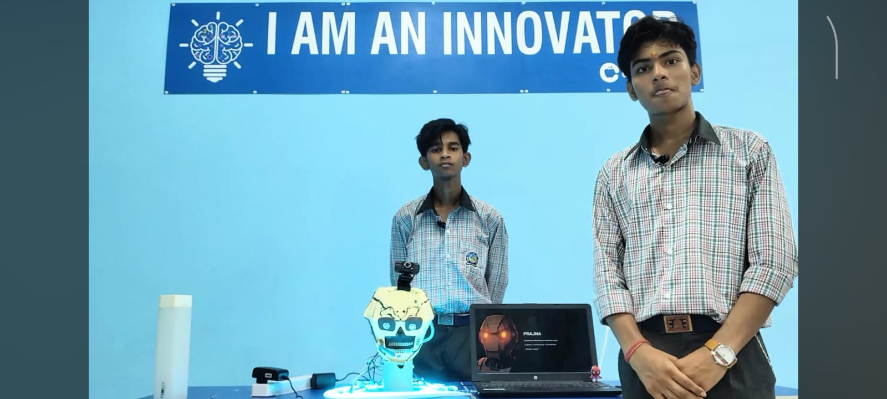
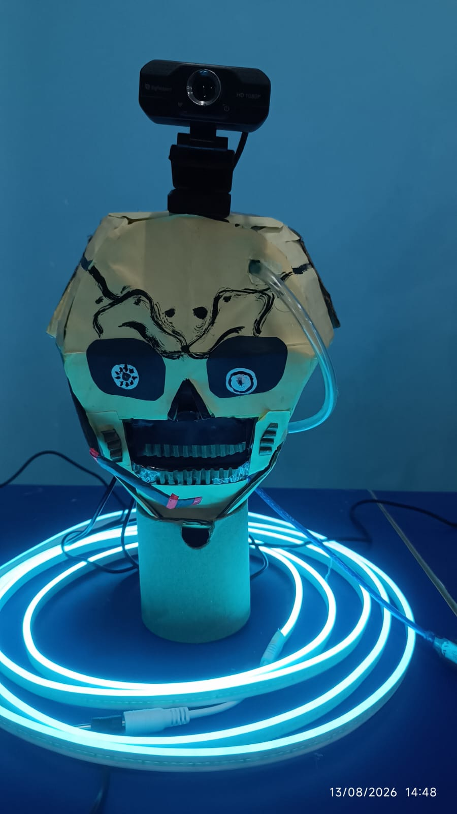

# PRAJNA (प्रज्ञा) — Autonomous Multilingual Interaction Head

**"It Listens. It Understands. It Coordinates."**

Built by **Mayank** — a school science exhibition project combining physical robotics, computer vision, speech recognition, and multi-agent AI orchestration.

*Mayank with PRAJNA, the AI robot he built for his science exhibition project.*

## What is PRAJNA?

PRAJNA is a physical AI robotic head with a rotating neck, expressive RGB LED eyes, real-time face tracking, and multilingual voice interaction (Hindi/English/Hinglish). Built using an Arduino Mega, servo motor, RGB LEDs, webcam, microphone, and a laptop running Python with Google Gemini AI.

Unlike a standard voice assistant, PRAJNA operates in two distinct modes:

### 🗣️ Normal Mode
A multilingual conversational assistant that observes people, tracks faces, listens, and responds intelligently — with expressive LED "eyes" that change color and speed based on state (idle, listening, thinking, speaking).

### 🛰️ Mission Mode — Multi-Agent AI Orchestration
PRAJNA coordinates a team of specialist AI agents (Orbit Analyst, Risk Assessor, Maneuver Planner, Communications Officer) to analyze a live satellite collision-avoidance scenario — each agent contributing a specialized perspective, which PRAJNA then synthesizes into one final, coordinated decision. This demonstrates a real, emerging concept: AI-assisted mission control for space operations, replicating in seconds what traditionally requires a coordinated team of human specialists.

## Why This Matters

Space agencies today rely on teams of human specialists working together in real time to manage satellite operations, particularly collision avoidance amid growing orbital debris (the "Kessler Syndrome" problem). PRAJNA is a working prototype demonstrating how physically embodied, multi-agent AI systems could assist in this kind of real-time coordination.

## Tech Stack

- **Hardware:** Arduino Mega, servo motor, RGB LEDs, USB webcam, microphone
- **Computer Vision:** OpenCV (Haar Cascade face detection)
- **Speech Recognition:** Google Speech Recognition API
- **Text-to-Speech:** Microsoft Edge Neural TTS (edge-tts)
- **AI:** Google Gemini API (conversational responses + multi-agent orchestration)
- **Language:** Python 3.12

## Skills Demonstrated

Artificial Intelligence · Multi-Agent AI Systems · Computer Vision · Speech Recognition · Robotics & Automation · Human-AI Interaction · Multilingual NLP

## Creator

Built entirely by **Mayank**, a school student, using accessible materials — no 3D printing, no expensive fabrication, no professional lab.

---
## Gallery

*Project featured on [LinkedIn](your-linkedin-post-link-here) and [Instagram]([](https://www.instagram.com/itoshi.mayankxo?igsh=MXduemI1YnY3ZGJrMg==))*
